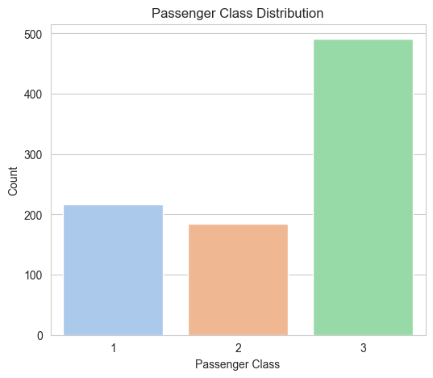
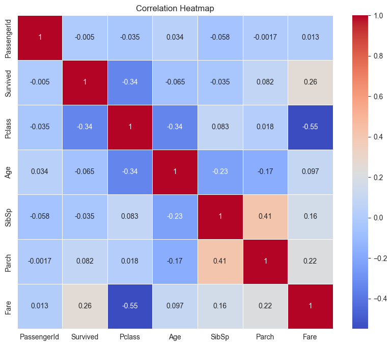
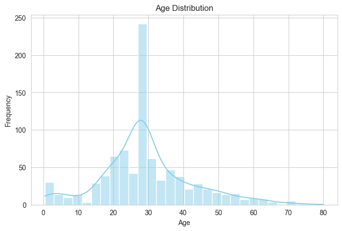
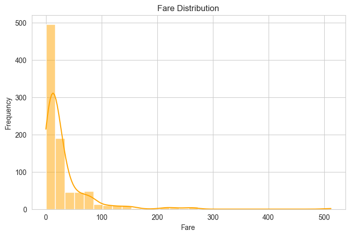

# 🚢 Titanic Dataset - Exploratory Data Analysis (EDA)

## 📌 Project Overview

This project performs Exploratory Data Analysis (EDA) on the Titanic dataset to identify factors that influenced passenger survival. Various visualizations and statistical analyses were used to uncover meaningful insights.

This project was completed as **Task 1** of the **VedGrow Data Analytics Internship**.

---

## 📂 Dataset

- Dataset: Titanic Dataset
- Records: 891
- Features: 12 (before preprocessing)

---

## 🛠️ Tools & Libraries Used

- Python
- Pandas
- NumPy
- Matplotlib
- Seaborn
- Jupyter Notebook

---

## 📊 Analysis Performed

- Data Loading
- Data Exploration
- Missing Value Analysis
- Data Cleaning
- Survival Analysis by Gender
- Survival Analysis by Passenger Class
- Survival Analysis by Age Group
- Correlation Heatmap
- Age Distribution
- Fare Distribution
- Passenger Class Distribution

---
## 📸 Output Screenshots

### Survival by Gender


### Survival by Passenger Class


### Correlation Heatmap


### Age Distribution


### Fare Distribution


## 📈 Key Insights

- Female passengers had a significantly higher survival rate than male passengers.
- First-class passengers were more likely to survive.
- Most passengers belonged to the Young Adult and Adult age groups.
- Passenger fares showed a right-skewed distribution.
- Passenger class had a stronger relationship with survival than age.
- Third-class passengers formed the largest group in the dataset.

---

## 📁 Project Structure

```
VedGrow_DA_01
│
├── Titanic_EDA.ipynb
├── Titanic-Dataset.csv
├── README.md
├── requirements.txt
└── images/
```

---

## 🚀 How to Run

1. Clone this repository.

2. Install the required libraries:

```
pip install -r requirements.txt
```

3. Open the Jupyter Notebook:

```
jupyter notebook
```

4. Run all cells in `Titanic_EDA.ipynb`.

---

## 📜 Internship Information

**Organization:** VedGrow

**Track:** Data Analytics

**Task:** Task 1 - Exploratory Data Analysis (Titanic Dataset)

---

## 👩‍💻 Author

**SAI CHARITHA AMARNENI**

Data Analytics Intern at VedGrow